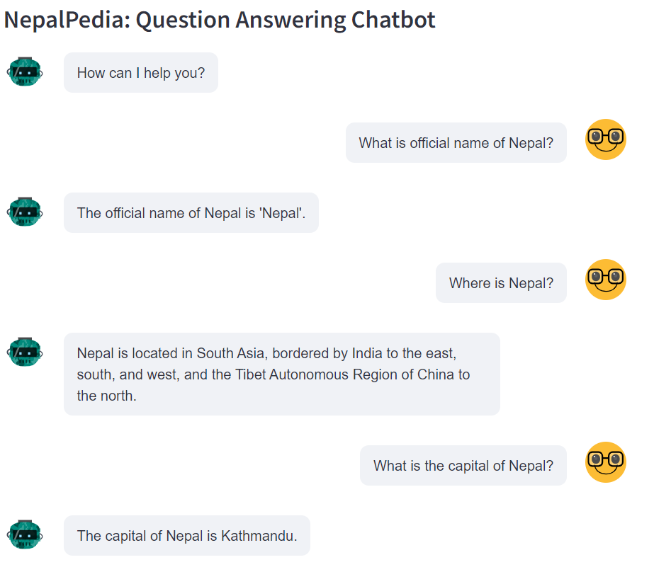
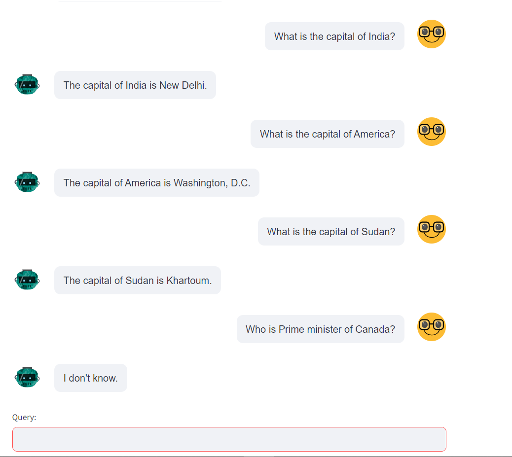

# NepalPedia Chatbot Project

## Introduction
NepalPedia is an innovative chatbot project designed to provide an interactive and informative experience related to Nepal. NepalPedia serves as a virtual guide, offering insights into Nepal's rich culture, history, and attractions.

## Objectives
### Project Objectives
- **User-Friendly Interface:** Develop a chatbot with an intuitive interface for effortless information retrieval.
- **Enhanced User Experience:** Utilize natural language processing for an enhanced user experience through conversational interactions.
- **Educational Platform:** Create a platform serving as an educational tool, promoting learning about Nepal's culture, history, and traditions.
- **Bridge Information Gap:** Bridge the gap between users and valuable information, making it easily accessible to a diverse audience.
- **Cultural Promotion:** Foster cultural promotion by offering insights into Nepal's diverse heritage and attractions.

### Working of NepalPedia Chatbot Using RAG

- **Requirements (R):**
  - The Requirements phase identified the necessity for an intuitive user interface and educational content.

- **Architecture (A):**
  - Architecture was developed considering the incorporation of OpenAI's chatGpt-3.5-turbo for natural language processing.

- **Generation (G):**
  - Generation focused on creating dynamic and context-aware responses, ensuring a more human-like interaction.

## Use of ChatGPT-3.5-turbo as LLM
### Leveraging OpenAI's chatGPT-3.5-turbo
- **Advanced NLP Capabilities:** OpenAI's model was chosen for its advanced natural language processing capabilities.
- **Contextual Understanding:** Enables NepalPedia to understand user queries in context, creating a more natural and responsive interaction.
- **Versatile Applications:** The model's versatility allows NepalPedia to cater to a wide range of user queries and topics.
- **Adaptability:** The chatGPT-3.5-turbo adapts to different user preferences, offering a personalized experience.
- **Enhanced Conversational Flow:** The model enhances the conversational flow, making interactions with NepalPedia feel more like a human conversation.

## Working of the Project
### Setting up the Virtual Environment and Running the Project
1. **Open Virtual Environment:**
   ```bash
   virtualenv env
   source env/bin/activate  # On Windows, use 'env\Scripts\activate'

2. **Install Requirements:**
   ```bash
   pip install -r requirements.txt

3. **Run Using Streamlit:**
   ```bash
   streamlit run main.py

3. **Access the Application:**
Open your web browser and go to http://localhost:8501 to interact with NepalPedia.

## Demonstration

### Screenshot 1

*Caption: Example of NepalPedia Chatbot's user interface, showcasing a conversational interaction.*

### Screenshot 2

*Caption: Another snapshot of NepalPedia Chatbot in action, demonstrating the chatbot's versatility and information presentation.*
